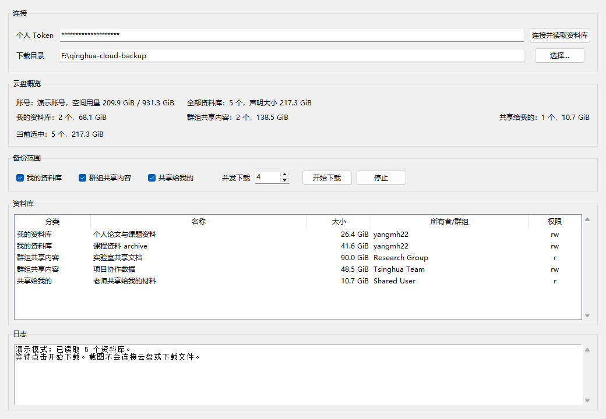

# THU Cloud Keeper

清华云盘自助备份工具，一个用于备份清华云盘（Seafile）资料库、群组共享内容和“共享给我的”内容的桌面 App。

## 项目缘起

毕业离校整理资料时，我发现清华云盘里分散着多年的课程资料、科研文档、群组共享文件和别人共享给自己的材料。网页端适合日常查看，但如果想在离校前完整备份所有可访问内容，就需要反复进入不同资料库手动下载，容易漏掉群组共享或“共享给我的”文件，也很难提前估算总数据量。

于是有了 THU Cloud Keeper：输入清华云盘个人 Token，选择本地目录，勾选需要备份的范围，然后让程序自动枚举资料库、显示大小、并发下载、断点续跑。它不是清华云盘官方客户端，而是一个在重要时间点帮助用户把自己的资料稳妥带走的小工具。

## 界面预览



## 功能

- 连接清华云盘账号并读取可访问资料库。
- 分别备份“我的资料库”“群组共享内容”和“共享给我的”内容。
- 显示账号空间用量、资料库数量和各分类声明大小。
- 支持设置并发下载数量。
- 已存在且大小与云端修改时间一致的文件会自动跳过。
- 使用 `.part` 临时文件保存未完成下载，方便中断后继续。
- 自动生成备份元数据、资料库清单、文件清单和失败日志。
- 支持命令行增量同步和 Windows 每日自动同步任务。

## 下载

最新的 Windows 和 macOS 构建产物可以在 GitHub Actions 的构建结果中下载：

<https://github.com/yangmh22/thu-cloud-keeper/actions>

在成功的 `Build desktop apps` workflow 中下载对应 artifact：

```text
tsinghua-cloud-backup-windows
tsinghua-cloud-backup-macos
```

## 使用方法

### Windows

下载并解压 Windows artifact 后，双击运行：

```text
清华云盘自助备份\清华云盘自助备份.exe
```

### macOS

下载并解压 macOS artifact 后，打开：

```text
清华云盘自助备份.app
```

如果 macOS 阻止打开未签名 App，可以在“系统设置 -> 隐私与安全性”中允许打开。也可以在终端中执行：

```bash
xattr -dr com.apple.quarantine "清华云盘自助备份.app"
```

### 获取清华云盘 Token

打开清华云盘个人设置页面：

<https://cloud.tsinghua.edu.cn/profile/>

在页面中获取个人 Token，粘贴到 App 的“个人 Token”输入框，然后点击“连接并读取资料库”。读取完成后，App 会展示各类资料库数量和大小。确认下载目录与勾选范围后，点击“开始下载”。

Token 只在运行时用于请求清华云盘 API。桌面 App 默认不会保存 Token，也不会把 Token 写入日志或备份元数据。下面的每日自动同步功能会把 Token 存入 Windows Credential Manager，避免把明文 Token 写进脚本、命令行或计划任务参数。

## Windows 每日自动同步

每日自动同步不需要每次全量重新下载。程序会重新扫描云端文件清单，并和本地目录比较；本地已有且大小、云端修改时间一致的文件会跳过，只有新增或变化的文件会下载。

先从源码目录安装命令行入口：

```powershell
python -m pip install -e .
```

然后把清华云盘 Token 存入 Windows Credential Manager。这样计划任务不需要在命令行、脚本或环境变量里保存明文 Token：

```powershell
.\scripts\store_token.ps1
```

可以先做一次只读检查：

```powershell
python -m tsinghua_cloud_backup.cli check
```

注册每天凌晨 4 点自动同步到 `D:\Fbackup\清华云盘备份`：

```powershell
.\scripts\install_scheduled_sync.ps1
```

也可以自定义时间、目录和并发数：

```powershell
.\scripts\install_scheduled_sync.ps1 -At "04:00" -Destination "D:\Fbackup\清华云盘备份" -Workers 4
```

计划任务名称是 `THU Cloud Keeper Daily Sync`。同步日志会写入：

```text
D:\Fbackup\清华云盘备份\_backup_metadata\scheduled_logs\
```

手动运行一次同步：

```powershell
.\scripts\run_scheduled_sync.ps1 -Destination "D:\Fbackup\清华云盘备份"
```

只扫描差异、不下载文件：

```powershell
.\scripts\run_scheduled_sync.ps1 -Destination "D:\Fbackup\清华云盘备份" -DryRun
```

删除计划任务：

```powershell
Unregister-ScheduledTask -TaskName "THU Cloud Keeper Daily Sync" -Confirm:$false
```

检查计划任务最近一次运行状态：

```powershell
Get-ScheduledTaskInfo -TaskName "THU Cloud Keeper Daily Sync"
```

默认计划任务使用当前 Windows 用户的交互式登录身份运行。也就是说，电脑在凌晨 4 点需要开机，且该用户需要处于已登录或可交互运行的状态；如果希望“用户未登录也运行”，需要在 Windows 任务计划程序里为该任务配置保存 Windows 凭据。

## 备份目录结构

备份目录下会生成：

```text
我的资料库/
群组共享内容/
共享给我的/
_backup_metadata/
```

`_backup_metadata` 中包括：

```text
manifest.json
repositories.csv
files.csv
backup.log
failures.jsonl
```

## 注意事项

- 本项目是个人自助备份工具，不是清华大学或清华云盘官方项目。
- 下载范围取决于清华云盘账号权限；账号无权访问的内容无法备份。
- 页面显示的大小来自清华云盘/Seafile API 的声明大小，实际落盘大小可能因重复文件、临时文件或文件系统差异略有变化。
- 第一次完整备份可能很慢，请连接稳定网络并预留足够磁盘空间。
- 重复运行同一备份目录会跳过已完整下载的文件，适合中断后继续。
- Windows 用户可以配置每日定时增量同步，见 [Scheduled Sync](docs/scheduled-sync.md)。

## 开发者指南

需要 Python 3.10 或更高版本。

从源码运行：

```bash
python -m pip install -e .
tsinghua-cloud-backup
```

也可以直接运行模块：

```bash
PYTHONPATH=src python -m tsinghua_cloud_backup.app
```

Windows 本地打包：

```powershell
.\scripts\package_windows.ps1
```

macOS 本地打包：

```bash
chmod +x scripts/package_macos.sh
./scripts/package_macos.sh
```

仓库包含 `.github/workflows/build.yml`。可以在 GitHub 页面中手动触发 `Build desktop apps` workflow，也可以推送 `v*` tag 自动触发构建。

## License

This project is licensed under the MIT License. See [LICENSE](LICENSE) for details.
